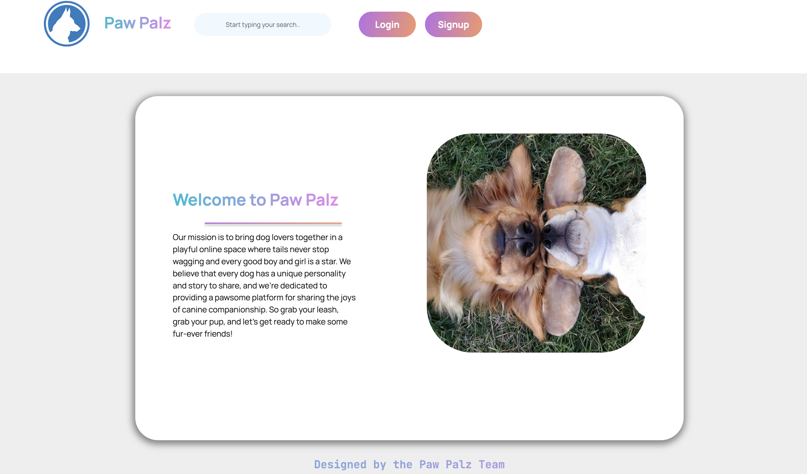
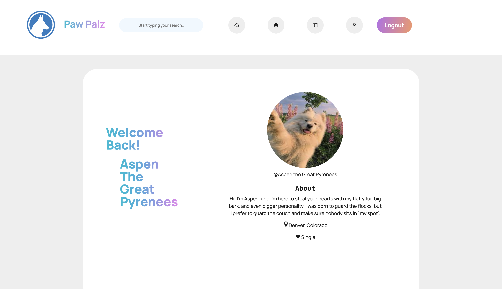

 <h2 align='center'>
  <a href= "#" target="_blank">PawPalz 🐶</a>
  </h2>

 &nbsp;

 &nbsp;

## Table Of Contents

1. [Description](#description)
2. [Installation](#installation)
3. [Usage](#usage)
4. [Demo](#demo)
5. [Tech Stack](#tech-stack)
6. [Deployed Link](#deployed-link)
7. [License](#license)
8. [Contributors](#contributors)
9. [Contact us](#contact-us)

## 📝 Description

---

Paw Palz is the premier social media platform designed exclusively for dogs! With its user-friendly interface, owners can easily create profiles for their furry friends, share photos and updates, connect with other dog owners, and even plan playdates. Paw Palz is the ultimate community for dog lovers and their beloved companions. Join us and let the tail-wagging begin!

## ⚙️ Installation

---
1. To install my Paw Palz the user can `git clone` our repo.
2. The user can run `npm i` to install all neccessary dependencies. 
3. The user can run `npm run develop`. 
4. The user can navigate to open [http://localhost:3001](http://localhost:3001) to view it in the browser.

## 🛠 Usage
---
* When the user opens the app they will be presented with a landing page that displays our mission statement.
* The user will see a login button and a signup button within the navbar.
* The user can choose to log in or create a new profile. 
* The user will then be presented with the Paw Palz homepage.
* The user will see a welcome card that dispalys a profile picture and a bio. 
* If the user scrolls down the page they will see a feild in which they can create a post. 
* The user can create a post and it will display in the post list.
* The user can navigate to the different pages within by clicking on the icons with in the navbar. 
* The Palz page displays all of the users current "Palz".
* The Walks page displays all of the current users favorite walks. 
* The Account page displays all of the users account information. 

## 🎥 Demo
---

## 💻 Tech Stack
---

 &nbsp;

## Deployed Link

---
https://obscure-sands-38875.herokuapp.com/

## License

---

The project is protected under the MIT license. Please follow the following link if you'd like more details about this license https://choosealicense.com/licenses/mit/

## Contributors
---

Robert Arellano, Antonio Duran, Luke Ohde, and Matt Tomchik

## Contact Us
---

https://github.com/rarellano5280/PawPalz
